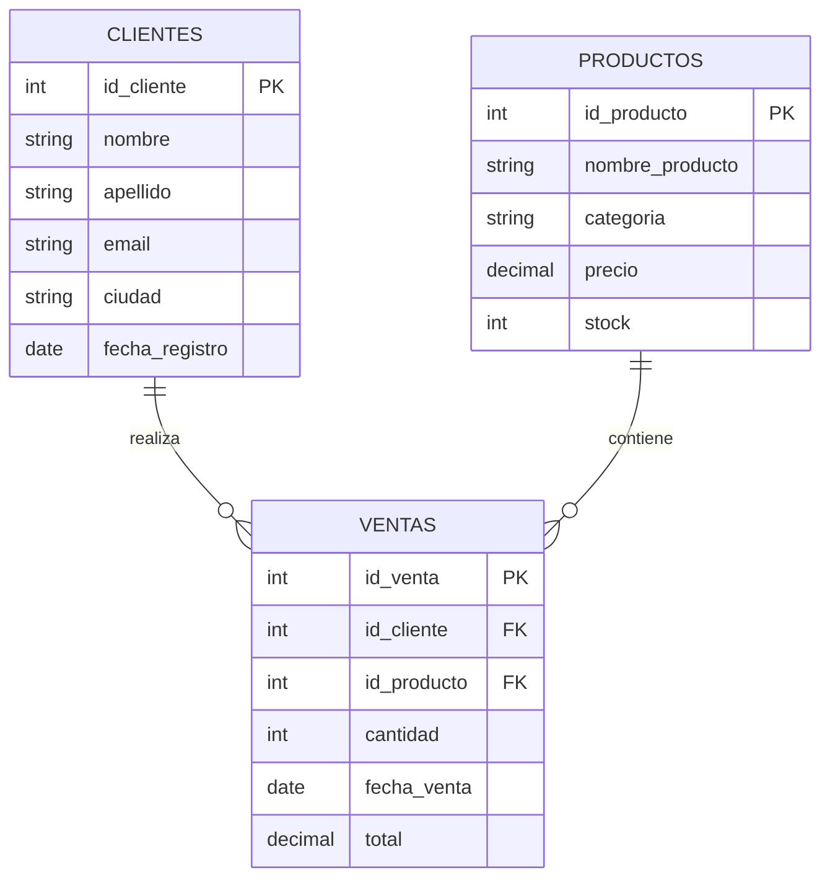

# ⚡ SQLCraft Studio

> **Plataforma Interactiva de Práctica y Aprendizaje de SQL** impulsada por **SQLite WASM** directamente en el navegador web y sincronización en la nube con **Supabase**.


---

## 🎯 Características Principales

- **💻 100% Ejecución en Navegador (SQLite WASM):** Sin necesidad de instalar servidores de bases de datos locales pesados; la base de datos `tienda.db` corre dentro del navegador web mediante WebAssembly.
- **📚 90 Desafíos Progresivos:**
  - **30 Básico:** `SELECT`, `WHERE`, `ORDER BY`, `LIKE`, `IN`, `BETWEEN`, `LIMIT`, funciones escalares.
  - **30 Intermedio:** `INNER JOIN`, `LEFT JOIN`, `GROUP BY`, `HAVING`, agregaciones (`COUNT`, `SUM`, `AVG`), subconsultas y operadores de conjunto (`UNION`).
  - **30 Avanzado:** Window Functions (`ROW_NUMBER`, `RANK`, `DENSE_RANK`, `LAG`, `LEAD`), Common Table Expressions (`WITH CTE`), subconsultas correlacionadas, agregaciones avanzadas.
- **☁️ Autenticación y Sincronización en la Nube (Supabase):**
  - Registro e inicio de sesión seguro.
  - Guarda automáticamente el progreso (retos resueltos, código de cada solución y estadísticas) en Supabase para que los usuarios puedan continuar en cualquier dispositivo sin perder datos.
  - Funciona también en modo **Invitado Offline** con `localStorage`.
- **⚖️ Veredicto Inteligente:**
  - Comprobador automático que evalúa las consultas contra el resultado oficial esperado comprobando columnas, tipos y filas.
  - Sistema de reputación: distingue entre retos resueltos **limpiamente (✅)** y retos resueltos **con ayuda (❌)** si se consultó la respuesta antes de completarlo.
- **🖥️ Paneles Redimensionables:**
  - Ajusta el tamaño de la consola, enunciado, resultado y barra lateral arrastrando divisores interactivos.
- **🧪 Modo Sandbox Libre:**
  - Espacio de juego para experimentar con cualquier consulta SQL personalizada en las tablas `clientes`, `productos` y `ventas`.
- **📖 Chuleta SQL y Atajos de Teclado:**
  - Modal integrado con sintaxis rápida de SQL y atajos como `Ctrl+Enter` para probar y `Ctrl+Shift+Enter` para comprobar.

---

## 🏗️ Estructura de la Base de Datos (`tienda.db`)

La plataforma incluye un esquema de comercio electrónico realista con 3 tablas interconectadas:



---

## 🚀 Despliegue y Ejecución

### Opción 1: Docker (Recomendado)

```bash
# Iniciar contenedor con Nginx optimizado
docker compose up -d
```
Abre tu navegador en: **`http://localhost:8080`**

### Opción 2: Servidor Local (Python)

```bash
python -m http.server 5173
```
Abre tu navegador en: **`http://localhost:5173`**

---

## 🛠️ Configuración de Supabase (Opcional para Nube)

Si deseas conectar tu propio proyecto de Supabase:
1. Crea un proyecto en [Supabase](https://supabase.com).
2. Ejecuta el script [`supabase_setup.sql`](./supabase_setup.sql) en el **SQL Editor** de tu panel de Supabase para crear la tabla `user_progress` y sus políticas RLS.
3. Actualiza tu URL y anon key en [`js/auth.js`](./js/auth.js).

---

## 📦 Tecnologías Utilizadas

- **Frontend:** HTML5, CSS3 moderno (Glassmorphism, Flexbox/Grid, Animaciones CSS).
- **Editor de Código:** [CodeMirror 5](https://codemirror.net/) con modo SQL y autocompletado inteligente.
- **Motor de Base de Datos:** [sql.js](https://github.com/sql-js/sql.js/) (SQLite compilado a WebAssembly).
- **Backend & Auth:** [Supabase JS Client v2](https://supabase.com/docs/reference/javascript).
- **Contenedor:** Docker & Nginx Alpine.
